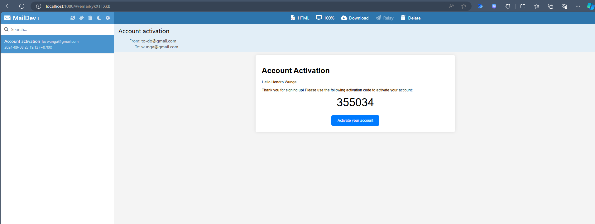

# Book Social Network - Spring Boot API


Backend API untuk platform jejaring sosial bagi para pecinta buku. Proyek ini dibangun dengan arsitektur yang solid menggunakan Spring Boot, menyediakan serangkaian RESTful API yang aman dan efisien untuk mengelola pengguna, buku, dan interaksi sosial seperti berbagi dan meminjam buku.

## 📖 Tentang Proyek

Platform ini bertujuan untuk menciptakan komunitas di mana pengguna dapat:
- Membuat profil dan terhubung dengan sesama pembaca.
- Mendaftarkan koleksi buku pribadi mereka.
- Berbagi, meminjam, dan melacak buku dalam komunitas.
- Memberikan ulasan dan rekomendasi.

Proyek ini berfungsi sebagai backend yang kuat untuk mendukung semua fitur tersebut, dengan fokus pada keamanan, skalabilitas, dan kemudahan pemeliharaan.

## ✨ Fitur Utama

- **Authentication & Security**:
    - Registrasi pengguna yang aman dengan aktivasi akun melalui email.
    - Otentikasi berbasis **JWT (JSON Web Tokens)** dengan *Access Token* dan *Refresh Token*.
    - Endpoint yang dilindungi berdasarkan peran dan status otentikasi pengguna menggunakan **Spring Security**.

- **Manajemen Buku (CRUD)**:
    - Operasi CRUD (Create, Read, Update, Delete) penuh untuk data buku.
    - Kemampuan untuk mengunggah dan menyajikan gambar sampul buku.
    - Pemilik buku dapat mengarsipkan atau menandai buku sebagai dapat dibagikan (`shareable`).

- **Sistem Interaksi Sosial**:
    - **Peminjaman Buku**: Pengguna dapat meminjam buku yang ditandai `shareable` oleh pemiliknya.
    - **Siklus Pengembalian**: Alur lengkap untuk mengembalikan buku yang dipinjam, termasuk persetujuan dari pemilik buku.
    - **Tampilan Terfilter**: Endpoint untuk melihat buku milik sendiri, buku yang sedang dipinjam, dan buku yang sudah dikembalikan.

- **Kualitas Kode & Dokumentasi**:
    - Respon API yang terstruktur dengan baik, termasuk **paginasi** untuk daftar data.
    - Konfigurasi yang bersih dan terpisah untuk lingkungan yang berbeda (`dev`, `prod`, dll.).
    - Lingkungan pengembangan yang mudah diatur menggunakan **Docker Compose**.

## 🛠️ Tumpukan Teknologi (Tech Stack)

| Komponen | Teknologi |
| :--- | :--- |
| **Bahasa & Framework** | `Java 17+`, `Spring Boot 3+` |
| **Keamanan** | `Spring Security 6`, `JWT` |
| **Database** | `PostgreSQL`, `Spring Data JPA`, `Hibernate` |
| **Kontainerisasi** | `Docker`, `Docker Compose` |
| **Email (Dev)** | `MailDev` |
| **Lain-lain** | `Lombok`, `Maven/Gradle` |

## 🚀 Memulai

Untuk menjalankan proyek ini secara lokal, Anda memerlukan:
- [JDK (Java Development Kit)](https://www.oracle.com/java/technologies/downloads/) versi 17 atau lebih tinggi.
- [Docker](https://www.docker.com/get-started/) dan [Docker Compose](https://docs.docker.com/compose/install/).
- IDE seperti [IntelliJ IDEA](https://www.jetbrains.com/idea/) atau [VS Code](https://code.visualstudio.com/).
- Klien Git.

### ⚙️ Instalasi dan Konfigurasi

1.  **Clone repositori ini:**
    ```bash
    git clone https://github.com/hendrowunga/SpringBoot-Book-Social-Networking.git
    cd SpringBoot-Book-Social-Networking
    ```

2.  **Konfigurasi Koneksi Database:**
    Proyek ini menggunakan Docker Compose untuk menjalankan database. Anda perlu memastikan aplikasi Spring Boot Anda menggunakan kredensial yang benar.

    **Langkah 1: Periksa `docker-compose.yml`**
    Lihat `environment` pada service `postgres`:
    ```yaml
    services:
      postgres:
        environment:
          POSTGRES_USER: username 
          POSTGRES_PASSWORD: password 
          POSTGRES_DB: book_social_network
        ports:
          - 5432:5432

      mail-dev:
        container_name: mail-dev-bsn
        image: maildev/maildev
        ports:
         - 1080:1080
         - 1025:1025
    ```

    **Langkah 2: Sinkronkan `application-dev.yml`**
    Pastikan `username` dan `password` di file `src/main/resources/application-dev.yml` **sama persis** dengan yang ada di `docker-compose.yml`.
    ```yaml
    spring:
      datasource:
        url: jdbc:postgresql://localhost:5432/book_social_network
        username: username
        password: password
     jpa:
       hibernate:
       ddl-auto: update
     mail:
       host: localhost
       port: 1025
       username: username
       password: password
    application:
      security:
       jwt:
        secret-key: [YOUR_SECRET_KEY]
     mailing:
      frontend:
        activation-url: http://localhost:4200/activate-account
     file:
       uploads:
         photos-output-path: ./uploads
    server:
     port: 8088

    ```

### ▶️ Menjalankan Aplikasi

1.  **Jalankan Layanan Eksternal (Database & Email Server):**
    Buka terminal di root proyek dan jalankan:
    ```bash
    docker-compose up -d
    ```
    Perintah ini akan memulai:
    -   Kontainer **PostgreSQL** di port `5432`.
    -   Kontainer **MailDev** (untuk menangkap email) di port `1080` (UI) dan `1025` (SMTP).

2.  **Jalankan Aplikasi Spring Boot:**
    Buka proyek di IDE Anda dan jalankan kelas utama `BookSocialNetworkApplication`. Aplikasi akan berjalan di port `8088`.

## 📚 Dokumentasi API

Berikut adalah daftar endpoint API yang tersedia. Semua endpoint berada di bawah base path `/api/v1`.

### Authentication Endpoints
| Method | Endpoint                    | Deskripsi                                        | Memerlukan Otentikasi |
| :----- | :-------------------------- | :----------------------------------------------- | :-------------------- |
| `POST` | `/auth/register`            | Mendaftarkan pengguna baru dan mengirim email aktivasi. | **Tidak**             |
| `POST` | `/auth/authenticate`        | Login dan mendapatkan JWT Access & Refresh Token. | **Tidak**             |
| `GET`  | `/auth/activate-account`    | Mengaktifkan akun menggunakan token dari email.    | **Tidak**             |
| `POST` | `/auth/refresh-token`       | Memperbarui Access Token menggunakan Refresh Token. | **Ya** (Refresh Token) |

<details>
<summary>Contoh Payload untuk <code>POST /auth/register</code></summary>

```json
{
  "firstname": "John",
  "lastname": "Doe",
  "email": "john.doe@example.com",
  "password": "yourStrongPassword"
}
```
</details>

### Book Management Endpoints
| Method  | Endpoint                              | Deskripsi                                             | Memerlukan Otentikasi |
| :------ | :------------------------------------ | :------------------------------------------------------ | :-------------------- |
| `POST`    | `/books`                              | Menyimpan buku baru milik pengguna yang sedang login. | **Ya**                |
| `GET`     | `/books/{book-id}`                    | Mendapatkan detail buku berdasarkan ID-nya.           | **Ya**                |
| `GET`     | `/books`                              | Mendapatkan semua buku (dengan paginasi), kecuali milik pengguna. | **Ya**                |
| `GET`     | `/books/owner`                        | Mendapatkan semua buku milik pengguna yang sedang login. | **Ya**                |
| `GET`     | `/books/borrowed`                     | Mendapatkan semua buku yang dipinjam oleh pengguna.   | **Ya**                |
| `GET`     | `/books/returned`                     | Mendapatkan semua buku yang pernah dipinjam dan sudah dikembalikan. | **Ya**                |
| `PATCH`   | `/books/shareable/{book-id}`          | Mengubah status `shareable` (bisa dipinjam) pada sebuah buku. | **Ya**                |
| `PATCH`   | `/books/archived/{book-id}`           | Mengubah status `archived` pada sebuah buku.          | **Ya**                |
| `POST`    | `/books/borrow/{book-id}`             | Meminjam buku dari pengguna lain.                     | **Ya**                |
| `PATCH`   | `/books/borrow/return/{book-id}`      | Mengajukan pengembalian buku yang dipinjam.           | **Ya**                |
| `PATCH`   | `/books/borrow/return/approve/{book-id}` | Menyetujui pengembalian buku oleh pemilik buku.     | **Ya**                |
| `POST`    | `/books/cover/{book-id}`              | Mengunggah gambar sampul untuk sebuah buku.           | **Ya**                |


<details>
<summary>Contoh Payload untuk <code>POST /books</code></summary>

```json
{
  "title": "Effective Java",
  "authorName": "Joshua Bloch",
  "isbn": "978-0134685991",
  "synopsis": "A must-read for every Java programmer.",
  "shareable": true
}
```
</details>

### Alur Coba API:
1.  Gunakan `POST /auth/register` untuk membuat akun baru.
2.  Buka MailDev UI di **[http://localhost:1080](http://localhost:1080)** untuk melihat email aktivasi dan salin tokennya.

    
    *(Catatan: Pastikan Anda menempatkan screenshot di folder `.github/assets/` dan menamainya `maildev-screenshot.png` atau sesuaikan path di atas)*

3.  Gunakan `GET /auth/activate-account` dengan parameter token tersebut.
4.  Gunakan `POST /auth/authenticate` untuk login dan mendapatkan JWT.
5.  Gunakan token tersebut sebagai *Bearer Token* di *Authorization Header* untuk mengakses endpoint yang dilindungi.
